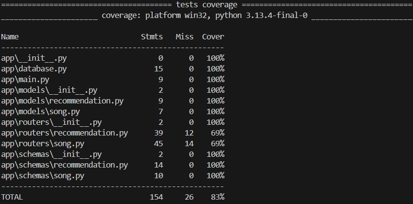

# VibeSync API

**VibeSync** is a RESTful API built with FastAPI and PostgreSQL that allows users to manage a list of songs and receive personalized book or movie recommendations based on a song's mood. The goal is to pair songs with media that match the same emotional tone or vibe.

---

## Features

- Full CRUD operations for both Songs and Recommendations
- PostgreSQL integration with SQLAlchemy ORM
- Environment-based configuration using `.env`
- Modular folder structure with routers, schemas, and models
- Auto-generated interactive API docs via Swagger UI

---

## Tech Stack

- Python 3
- FastAPI
- PostgreSQL
- SQLAlchemy
- Pydantic
- python-dotenv
- Uvicorn

---

## Project Structure

```
vibesync-api/
├── main.py
├── database.py
├── .env.example
├── requirements.txt
├── routers/
│   ├── song.py
│   └── recommendation.py
├── schemas/
│   ├── song.py
│   └── recommendation.py
└── models/
    ├── song.py
    └── recommendation.py
```

---

## Setup Instructions

### 1. Clone the Repository
```bash
git clone https://github.com/your-username/vibesync-api.git
cd vibesync-api
```

### 2. Install Dependencies
```bash
pip install -r requirements.txt
```

### 3. Set Up the Database
1. Create a PostgreSQL database (e.g., `vibesync_db`)
2. Copy the environment template:
   ```bash
   cp .env.example .env
   ```
3. Fill in your credentials in `.env`:
   ```env
   DB_USER=your_username
   DB_PASS=your_password
   DB_NAME=vibesync_db
   DB_HOST=localhost
   DB_PORT=5432
   ```

### 4. Run the Server
```bash
uvicorn main:app --reload
```

### 5. Test the API
Open your browser and navigate to: **http://localhost:8000/docs**

This will load the Swagger UI where you can interact with and test all the API endpoints.

---

## API Endpoints

### Songs
| Method | Endpoint | Description |
|--------|----------|-------------|
| `GET` | `/songs/` | Get all songs |
| `GET` | `/songs/{id}` | Get song by ID |
| `POST` | `/songs/` | Create a song |
| `PUT` | `/songs/{id}` | Update a song |
| `DELETE` | `/songs/{id}` | Delete a song |

### Recommendations
| Method | Endpoint | Description |
|--------|----------|-------------|
| `GET` | `/recommendations/song/{song_id}` | Get recommendations for a song |
| `POST` | `/recommendations/` | Create a recommendation |
| `PUT` | `/recommendations/{id}` | Update a recommendation |
| `DELETE` | `/recommendations/{id}` | Delete a recommendation |

---

## Running Tests

### Run All Tests
```bash
pytest
```

### Run Unit Tests with Coverage
```bash
pytest --cov=app tests/unit/
```

### Run Integration Tests
```bash
pytest tests/integration/
```

### Run API Tests with Coverage
```bash
pytest --cov=app tests/api/
```

---

## Testing Frameworks Used

- **pytest**: For writing and executing tests
- **pytest-cov**: For measuring code coverage
- **unittest.mock**: For mocking database sessions in unit tests
- **FastAPI TestClient**: For testing API endpoints

---

## Testing

Use the **Swagger UI** at http://localhost:8000/docs to test all endpoints. 

1. Click on any endpoint to expand it
2. Click "Try it out"
3. Fill in the required parameters
4. Click "Execute" to test

---

## Sample Data

### Create a Song
```json
{
  "title": "August",
  "artist": "Taylor Swift",
  "genre": "Pop",
  "mood": "melancholic"
}
```

### Create a Recommendation
```json
{
  "type": "book",
  "title": "The Summer I Turned Pretty",
  "description": "Nostalgic summer vibes matching the song's mood",
  "song_id": 1
}
```

---

## Test Coverage

> Overall test coverage: **83%**



---

## Notes

- Database tables are automatically created on first run
- All credentials are managed via `.env` for security
- Use Swagger UI for testing - no external tools needed